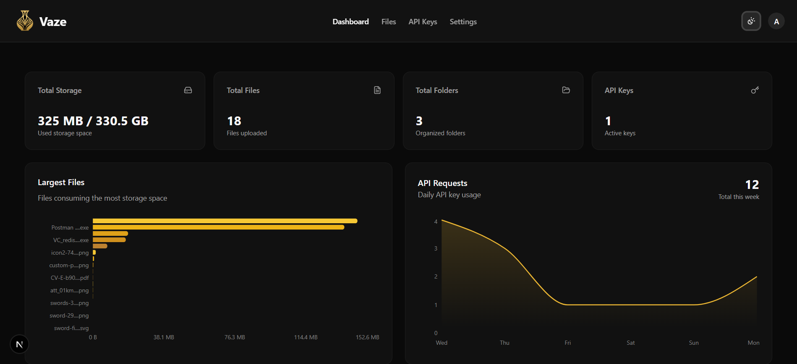
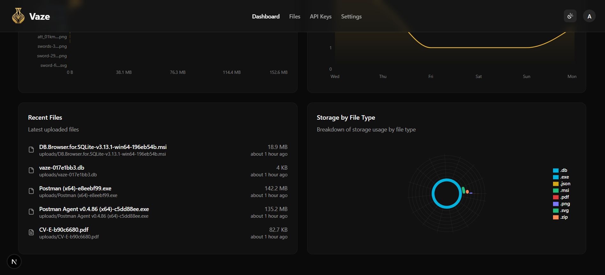
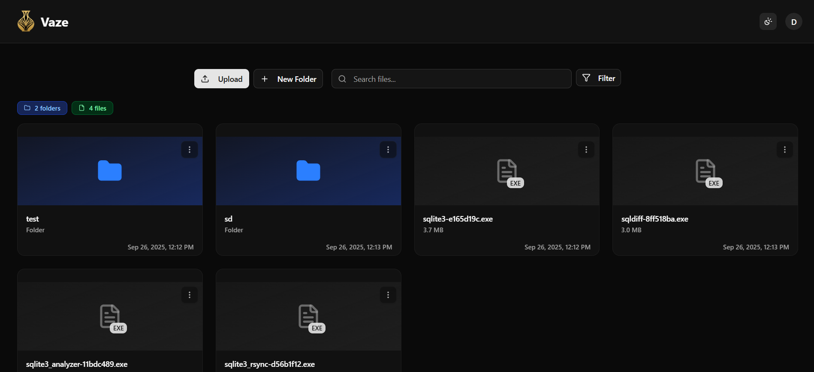
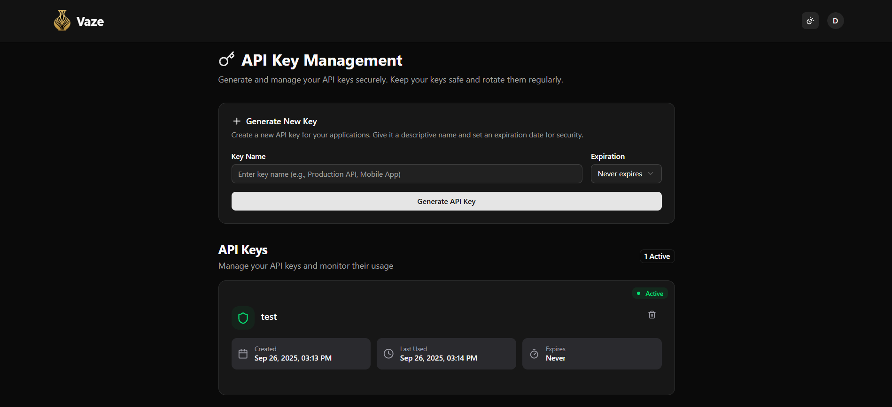
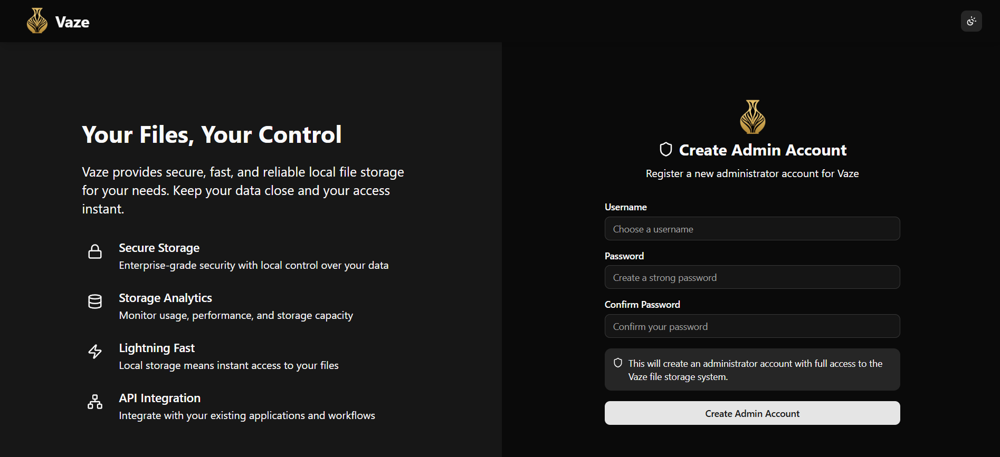

# Vaze | Local File Storage & Hosting

<div align="center">


[](https://hub.docker.com/r/darseen/vaze)
[](https://opensource.org/licenses/MIT)

**Vaze** is a self-hosted, local-first file storage and hosting service built with Next.js. Run it easily as a Docker container on your own server or home network. It provides a clean web interface for managing your files and a powerful API to use as a backend for your other applications.

## </div>

> [!IMPORTANT]  
> **Vaze is currently under active development.** This project is still in its early stages, and I'm continuously implementing new features and improvements.

## Features

- **Full File & Folder Management**: Create, rename, move, and delete files and folders directly from the web UI.
- **Simple Uploads**: Easily upload files and folders through a drag-and-drop interface.
- **Export & Download**: Download individual files or entire folders as a zip archive.
- **API Key Management**: Generate and manage API keys from a dedicated dashboard to securely interact with your storage from other apps.
- **Powerful API**: Use Vaze as a backend service for any application that needs file hosting or storage, with simple RESTful endpoints.
- **Dockerized**: Get up and running in minutes with the official Docker image.

---

## Getting Started

Getting your own Vaze instance running is simple. All you need is Docker installed on your system.

### 1. Pull the Docker Image

Pull the latest image from Docker Hub.

```bash
docker pull darseen/vaze:latest
```

## 2. Run the Container

Run the Docker container, mapping your volume, port, and setting your `BASE_URL`:

```bash
docker run -d \
  -p 3000:3000 \
  -v /path/on/your/host/machine:/app/data \
  -e BASE_URL="http://your-server-ip-or-domain:3000" \
  --name vaze \
  darseen/vaze:latest
```

- `-p 3000:3000`: Maps port 3000 on your host to the container's port 3000.
- `-v /path/on/your/host/machine:/app/data`: This mounts a directory from your host machine into the container. It ensures your uploaded files are saved on your machine and persist even if the container is removed or updated.

## 3. Initial Setup (Admin Registration)

Once the container is running, you need to create your first (admin) user.

1. Navigate to your server's IP address on port 3000 in your web browser: `http://<your-server-ip>:3000`
2. You will be prompted to register. The first user to register automatically becomes the admin user.
3. Log in with your newly created credentials.

That's it! You can now start uploading and managing your files.

## API Usage

Vaze can be used as a file-hosting backend for your other projects.

1. **Generate an API Key**: From the Vaze web app, go to the "API Keys" dashboard and generate a new key.
2. **Use the Key**: Pass this key in the Authorization header as a Bearer token in your API requests.

### Example: Uploading a file with cURL

```bash
curl -X POST http://<your-server-ip>:3000/api/files \
  -H "API-Key: YOUR_API_KEY" \
  -F "file=@/path/to/local/file.png"
```

The API will return a JSON response with the URL of the hosted file.

## Screenshots

Here are a few screenshots of the Vaze interface.

<div align="center">
  <h3> Main Dashboard View  </h3>
  
  
</div>

<div align="center">
  <h3> File Management Page </h3>
  
</div>

<div align="center">
  <h3> API Keys Management Page </h3>
  
</div>

<div align="center">
  <h3> Registration Page </h3>
  
</div>

## Contributing

Contributions are welcome! If you'd like to help improve Vaze, please feel free to fork the repository, make changes, and submit a pull request.

## License

This project is licensed under the MIT License. See the LICENSE file for details.
